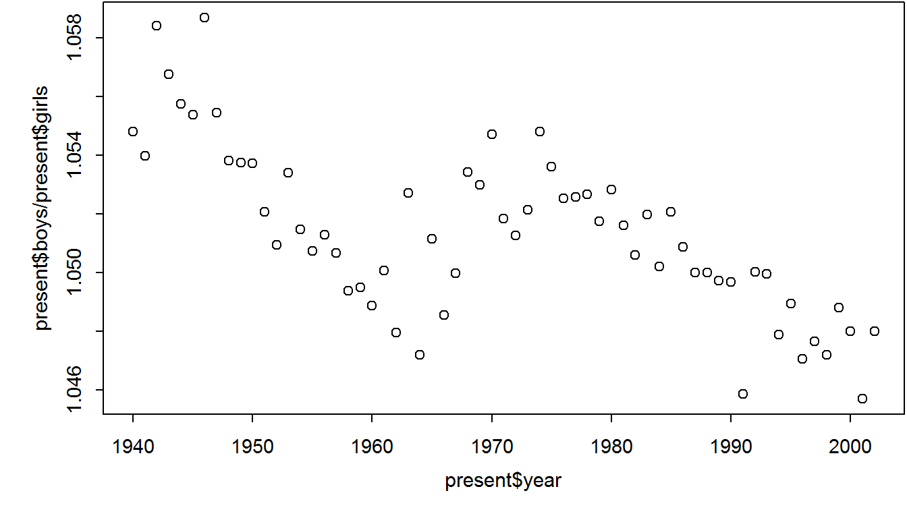
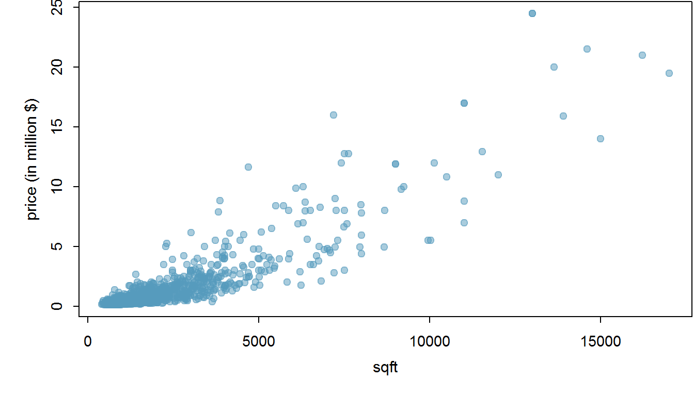
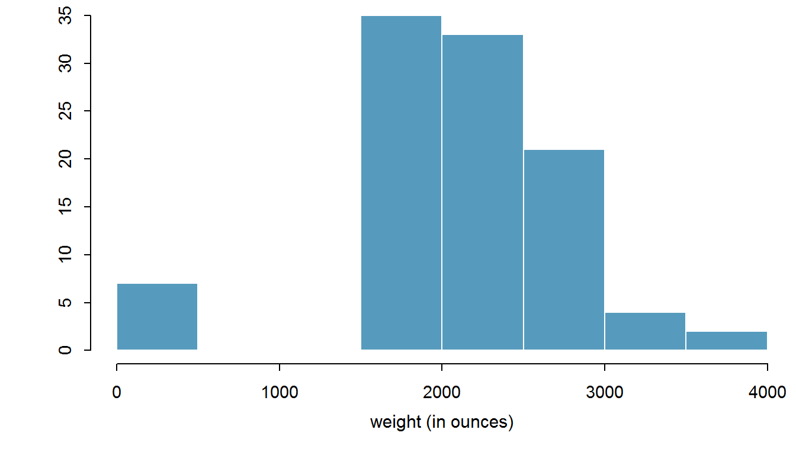

Five concrete reasons your students should be analyzing data in the reproducible paradigm
=========================

### Andrew Bray, Mine Cetinkaya-Rundel, Dalene Stangl

The next time you’re leafing (or more likely clicking) through a scientific journal, pick a paper and focus in on the description of the data analysis. As statisticians, it’s the analysis that naturally draws our attention, but this time, pay attention not to the question of, “What analysis did they use to come to their conclusions?” but rather, “Have the authors provided me with sufficient information to recreate their data analysis starting with the raw dataset to the last p-value?”. Surprisingly, and somewhat dismayingly, the answer to that question will likely be “no”.

An analysis that can be passed from one person to another and, using the same data, generate the same results in an unambiguous manner is reproducible. Despite evidence of the persistence of irreproducible data analysis in the sciences, these same journal authors would likely agree that reproducible analysis constitutes an integral part of the scientific process. So why the disconnect? Many reasons feed into this effect, but for this column we focus on one: once upon a time, these scientists were bright-eyed students sitting in their first data analysis course, and that course likely did not teach reproducible methods.

A typical workflow in data analysis has at least two major components: a statistical software package for performing the data analysis; and a layout package for presenting the results. Traditionally, the analyst’s work begins in their statistical package of choice (e.g. R, SAS, Minitab, Excel), where they perform the data analysis. Then, results are summarized and presented using a word processor (e.g. Microsoft Word, Google Docs, LaTeX). This workflow is ubiquitous, and in most undergraduate courses where students are expected to compute with data, student homework assignments are produced in this manner. Most often, tables, output, and plots are simply copied-and-pasted from the statistical package to Word. This copy-and-paste paradigm has many undesirable aspects: it is prone to errors, the presented results are not readily reproducible, the separation of computation from analysis makes it difficult, especially for a beginner in data analysis, to present their findings in a logical order, and it leaves room for selective presentation of results.

In this column, we discuss reasons why R Markdown, a simple, easy-to-learn, open source markup language, is an effective tool to teach introductory statistics in the reproducible paradigm.  R Markdown, based upon the free and open-source statistical programming language R, enables students to develop the basic capacity to undertake modern data analysis and communicate their results while avoiding the shortcomings of the copy-and-paste paradigm we listed above. This approach, in a nutshell, allows for transparent, reproducible, data analysis tightly integrated with written interpretation. At a high-level, it renders a well-annotated R script into a self-contained HTML, PDF, or Microsoft Word file, replete with graphics, commands, and stylized text.

The figure below displays snippets from the input (right) and output (left) of a data analysis report produced using R Markdown. R commands are typed directly into the markdown file, set off in chunks. The rendering engine then parses this file, first executing each of the R commands in the chunks and then processing the output from those commands. Additional content such as text for interpretations as well as lists, headers, tables, external images, and web links, etc. surround the R chunks in a standard way.

#### Exercise 7:

```r
source("http://www.openintro.org/stat/data/present.R")
plot(x = present$year, y = present$boys/present$girls)
```

 


While the ultimate goal of teaching in a reproducible paradigm is to prepare students to be responsible scientists in the future, you don’t have to wait until your students go off on scientific careers to see the fruits of your labor. The advantages of teaching data analysis in a reproducible framework become apparent from day one. We outline five concrete reasons:

### (1) Analyze iteratively:
This workflow establishes the norm that data analysis and science in general should be an iterative process. Just as our colleagues in English departments stress the importance of multiple drafts and multiple revisions, within this paradigm we are able to do the same, encouraging data analysis that is more thorough and also more thoughtful.

Consider the following situation: you have students that have been working with housing data and wish to describe the relationship between the square footage and sale price of homes in Los Angeles.  They probably started by constructing a scatterplot of these two variables:


```r
LA <- read.csv("http://bit.ly/chance_LAhomes")
plot(price/1e+06 ~ sqft, data = LA, pch = 19, col = COL[1, 3], ylab = "price (in million $)")
```

 


They would probably be able to identify the positive association between the two variables and possibly jump right into fitting a linear model.  Only once they've started writing up their interpretation will they realize that their residual plots look a bit troubling, most notably the dramatic outliers.  If they were working in a non-reproducible workflow, this would require that the data set be modified, perhaps in Excel, the plots would need to be remade, the model re-run, and then everything re-copied into their write-up.  Using R Markdown, they need only add two lines to restrict their analysis to those home with square footage less than 20000.


```r
mansions <- LA$sqft > 20000
LA_mansions <- LA[!mansions, ]
plot(price/1e+06 ~ sqft, data = LA_mansions, pch = 19, col = COL[1, 3], ylab = "price (in million $)")
```

 


When the students re-compile their markdown file, they will excluding the mansions and executing all of their downstream analysis in one click. 

The ease of this revision brings data analysis much closer to a workflow that students will recognize from a writing course, where multiple drafts pave the way to a final draft.  It allows us to demonstrate that an analysis is an iterative process involving critical feedback and revision.

### (2) Report transparently:
Often there are many data cleaning steps between the raw dataset and the dataset on which the final analysis is done. These steps are rarely outlined sufficiently in published work, and hence it can be difficult or impossible to replicate published results even with access to the dataset. When analysis is done and presented using markdown transparency, all steps of the analysis, including data cleaning, become an inherent part of the final outcome. While this level of detail may not always be appropriate for published work in a scientific journal, it is definitely desired for a data analysis report as part of coursework, especially in a course where students are just learning to use these data analysis and computational tools.

Consider this example: We asked students in an introductory statistics course on an anonymous survey to report their weights, in ounces. We then distributed these data back to the students and asked them to analyze it.


```r
wt <- read.csv("http://bit.ly/chance_weight")
par(mar = c(4.5, 2.5, 0.5, 0.5))
hist(wt$weight_ounces, main = "", col = COL[1], border = "white", ylab = "", 
    xlab = "weight (in ounces)", axes = FALSE)
axis(1)
axis(2, at = seq(0, 35, 5), labels = c(0, NA, 10, NA, 20, NA, 30, NA))
```

 


The first visualization of the data reveals a curious feature: a few students reported weighing less than 500 ounces (less than 31.25 lbs).


```r
wt$weight_ounces[which(wt$weight_ounces < 500)]
```

```
## [1] 120 165 185 175 123 124 180
```


These appear to be students who reported their weight in pounds instead of in ounces. Before proceeding with the analysis we instruct the students to correct this. However such a correction should be well documented and transparently presented so that others replicating the analysis starting with the same dataset can achieve the same results. So we create a new variable that converts the pounds to ounces for these observations.


```r
wt$weight_ounces_upd <- ifelse(wt$weight_ounces < 500, wt$weight_ounces * 16, 
    wt$weight_ounces)
hist(wt$weight_ounces_upd, main = "", col = COL[1], border = "white", ylab = "", 
    xlab = "weight (in ounces)", axes = FALSE)
axis(1)
axis(2, at = seq(0, 35, 5), labels = c(0, NA, 10, NA, 20, NA, 30, NA))
```

 


### (3) Collaborate seamlessly: 
Given that collaboration among researchers is now the norm, rather than the exception, providing students with opportunities to work collaboratively on projects even at the introductory level has been gaining popularity. While this is an invaluable experience for students, it can also be a source of frustration, and hence streamlining a collaborative workflow is worthwhile. R Markdown provides such a mechanism in part due to its inherent emphasis on reproducibility. Students working together are able to follow, and even extend, each other’s work with minimal effort. With the addition of use of an RStudio server or a third-party file synchronization solution (e.g. Dropbox) can provide a functional workaround for having multiple students edit the same R Markdown file.

### (4) Compute with clarity:
When students get their first chance to run freely in a programming environment such as R, the result is often a jumble of false starts, dead ends, and doubling back.  The freedom of this sandbox environment can lead to confusion and frustration.  A markdown document provides a structure that allows students to organize their thoughts and integrate their code with written interpretation.  While an analysis contained in a single script looks impenetrable to a new programmer, a markdown document bridges the computing language and the natural language and reads like a well-organized story.

### (5) Assess the reasoning, not just the final outcome:
If your students are getting their hands dirty in real data analysis, then you’ve opened yourself up to a grading challenge: how can you assess the quality of their analysis when all that is turned-in is the final product of a long string of decisions?  In fact, in the irreproducible paradigm, the final report has very little information that you can use to assess how students reasoned through each step in the analysis process.  A markdown document, by contrast, makes clear every choice they made from the first moment they loaded in the raw data set.

Reading a good final report produced in the traditional way, including only the narrative and selective output, can be like getting a postcard from your students at the summit of a mountain. It tells you that they have reached their final destination, but it tells you nothing about how they got there. Did they navigate the maps well and hike up on their own? Did they charter a helicopter to the top? Did they photoshop themselves into the picture? On the other hand, reading a good final report produced using markdown is like reading their detailed travel blog. It presents evidence of not only them making it to the top of the mountains, but also that they have the skills to navigate through their next adventure.

Teaching data analysis in the reproducible paradigm means being able to provide valuable and targeted feedback, but there is a more pragmatic element at play here too: grading a markdown document is easier than grading an irreproducible document.  With the entire analysis contained in a single file, you don’t need to shuffle through a jumble of plots and scripts.  It also removes the guesswork involved in inferring how the students reached their conclusions.

A 2013 Nature editorial has urged researchers to do whatever they can to improve research reproducibility. As statistics educators, we are the members of the scientific community that are most well-suited to, and responsible for, addressing this challenge. The introductory statistics course is a perfect candidate for when we should be instilling best practices in scientists-in-training as they are first introduced to data analysis tools in this course. Providing the students with the tools to do and present reproducible data analysis before teaching them rigorous methods highlights the importance of this issue, and with appropriate support mechanisms, introductory statistics students are receptive to its adoption.

**Note:** You can access a version of this article produced in R Markdown at http://rpubs.com/mine/21414 and the source files at [insert github link here].

**Further reading:**
* Baumer, Ben; Cetinkaya-Rundel, Mine; Bray, Andrew; Loi, Linda; & Horton, Nicholas J.(2014). R Markdown: Integrating A Reproducible Analysis Tool into Introductory Statistics.Technology Innovations in Statistics Education, 8(1). uclastat_cts_tise_20118. Retrieved from: http://escholarship.org/uc/item/90b2f5xh
* JJ Allaire, Jeffrey Horner, Vicent Marti and Natacha Porte (2014). markdown: Markdown rendering for R. R package version 0.7. http://CRAN.R-project.org/package=markdown
* Nature Editorial (2013), “Announcement: Reducing our irreproducibility,” Nature, 496, http:// www.nature.com/news/announcement-reducing-our-irreproducibility-1.12852.
* Xie, Y. (2013). Dynamic Documents with R and knitr. CRC Press.
* Stodden, V., Leisch, F., & Peng, R. D. (Eds.). (2014). Implementing Reproducible Research. CRC Press.
